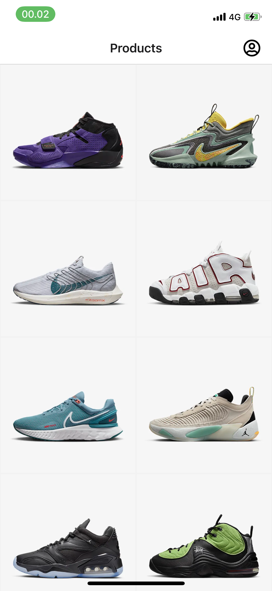
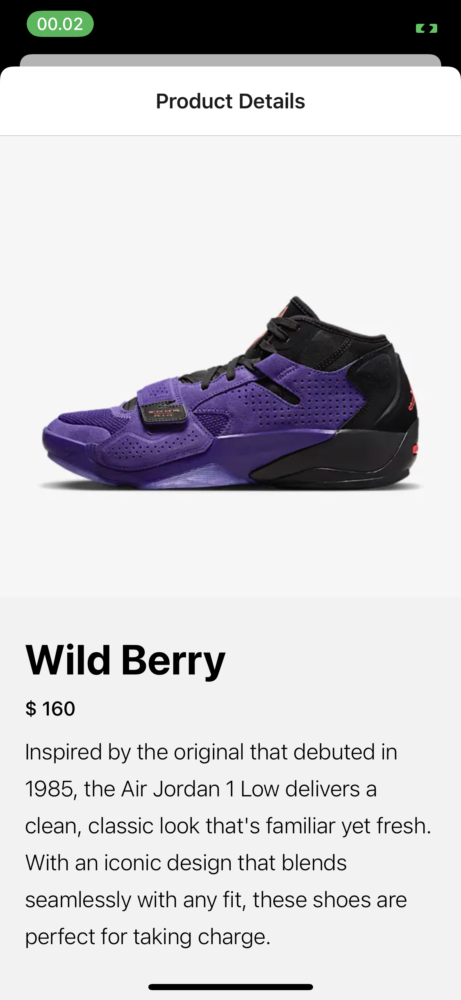
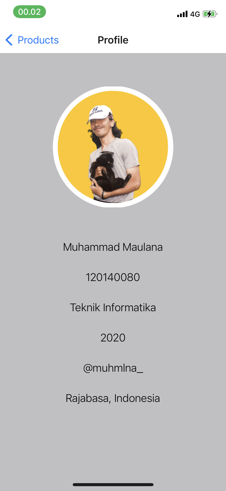

# UTS_Pengembangan Aplikasi Mobile RB

## Identitas :

- Muhammad Maulana
- 120140080
- Teknik Informatika ITERA

## Deskripsi Aplikasi

Aplikasi sederhana berbasis mobile yang menggunakan bahasa React Native serta berfungsi menampilkan produk dari DB Local yang dapat menunjukan produk serta detail dari produk tersebut dengan menggunakan redux. 
Tujuan dibuatnya aplikasi ini adalah untuk mempelajari bagaimana cara membuat app saat menggunakan  bahasa React Native serta state management (redux).

## Library yang digunakan

- @react-navigation/native
- @react-navigation/native-stack
- expo
- expo-status-bar
- react
- react-native
- react-native-safe-area-context
- react-native-screens
- react-redux

## Tampilan Aplikasi

    
    
    

